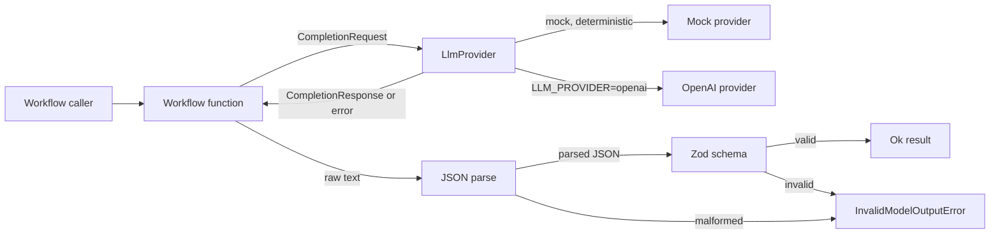
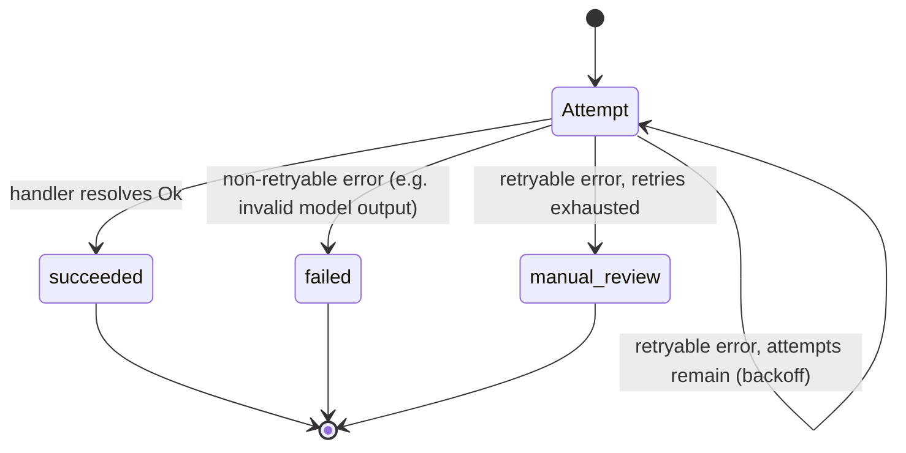

# 🤖 WorkWise AI

**AI automation workflows with structured outputs, validation, retries, RAG patterns, and tests.**


Most "AI automation" repos are one prompt call wrapped in a CLI. This one is four small workflows
that show what actually changes once you have to trust the output: validating what the model sends
back, retrying the calls that are worth retrying, and giving up cleanly on the ones that aren't.
Everything runs against a scripted mock provider by default, so you can clone it and run it without
an API key, then flip one env var when you're ready to point it at OpenAI.

## Features

- Structured output validation - the model's raw text gets parsed and run through a Zod schema
  before anything downstream trusts it. Bad JSON or an out-of-range value gets rejected instead of
  coerced.
- A retry helper (`withRetry`) that only retries errors marked as retryable, backs off linearly,
  and turns "every attempt failed" into its own error type instead of just re-throwing the last one.
- An async job runner that lands a background job in `succeeded`, `failed`, or `manual_review`,
  with the full attempt history attached - no infinite retry loops, no silent failures.
- RAG citation checking: the lookup workflow won't let the model cite a document it wasn't actually
  given.
- Document extraction that treats a missing field as a normal outcome (`needs_review`), not a crash.
- One `LlmProvider` interface, two implementations - the mock and a real OpenAI provider - so
  switching is an env var, not a rewrite.

## Tech stack

| Technology                          | Role                                                         |
| ----------------------------------- | ------------------------------------------------------------ |
| TypeScript (strict)                 | Type safety                                                  |
| Zod                                 | Validating model output and environment config               |
| Vitest                              | Tests, with coverage thresholds that actually fail the build |
| tsx                                 | Runs the demo locally without a build step                   |
| OpenAI API (optional)               | Swapped in via `LLM_PROVIDER`, not required                  |
| ESLint, Prettier, Husky, commitlint | Formatting, linting, commit message checks                   |
| GitHub Actions                      | CI - secret scan, commitlint, quality, audit, test, build    |

## Why bother

I've seen a lot of "here's how to call an LLM" examples, and almost none of them survive contact
with a model that occasionally returns something you didn't ask for. A few things I kept running
into and wanted to actually show working:

- Models don't reliably return what you asked for. Ask for JSON, sometimes you get JSON with a
  sentence in front of it, or a value outside the enum you specified.
- A timeout doesn't mean the request was bad, it means try again - but only a few times, and with
  some backoff, not in a tight loop.
- Some failures aren't worth retrying at all. If the model gave you garbage once against a
  deterministic mock, retrying the same input just gives you the same garbage again.
- Eventually something needs to fall through to a person. A background job can't just retry forever
  and hope.

So: four workflows, each built around one of those problems, plus the retry/provider/validation
plumbing that all four of them share.

## Architecture



Same shape every time: call the provider, parse the text as JSON, validate it, and only then hand
back a typed value. Workflows return a `Result<T, WorkflowError>` instead of throwing, which is
mostly so you can nest one workflow inside another (the demo runs the classifier inside the async
job runner) without a pile of try/catch.

The job runner adds a state machine on top of that for anything that runs in the background:



## Failure modes

| Scenario                                                       | Where it's caught      | What happens                                                 |
| -------------------------------------------------------------- | ---------------------- | ------------------------------------------------------------ |
| Provider call times out                                        | `ProviderTimeoutError` | retried, if attempts remain                                  |
| Provider call fails some other way (network, non-2xx)          | `ProviderFailureError` | retried, if attempts remain                                  |
| Response isn't valid JSON                                      | `parseJsonResponse`    | `InvalidModelOutputError`, not retried                       |
| Response doesn't match the schema (bad enum, wrong shape, ...) | Zod `safeParse`        | `InvalidModelOutputError`, not retried                       |
| RAG answer cites a document that wasn't retrieved              | `ragLookup`            | citation dropped; rejected outright if nothing legit is left |
| Extracted document is missing a field                          | `extractInvoice`       | `status: "needs_review"` - this one isn't really a failure   |
| Every retry attempt fails                                      | `withRetry`            | `RetryExhaustedError`                                        |
| Job's retries run out                                          | `runJob`               | `status: "manual_review"`, attempt log intact                |
| Job hits something non-retryable                               | `runJob`               | `status: "failed"` right away, no wasted attempts            |

Why `InvalidModelOutputError` doesn't get retried: everything here is deterministic (the mock
always is), so replaying the same broken request just gets you the same broken response again.
Retrying only makes sense for the stuff that's actually transient.

## Project structure

```text
src/
  config/env.ts              Zod-validated env config. Fails fast, never echoes the bad value.
  providers/
    types.ts                  LlmProvider interface every provider implements.
    mock-provider.ts           Scripted, offline provider - feeds tests and the demo.
    openai-provider.ts         Real provider: fetch + timeout + response validation.
    provider-factory.ts        mock vs. openai, decided by LLM_PROVIDER.
  shared/
    result.ts                  ok()/err() instead of throwing across workflow boundaries.
    errors.ts                  The WorkflowError types (see Failure modes above).
    retry.ts                    withRetry() - backoff, short-circuit, RetryExhaustedError.
    parse-json.ts               JSON.parse that returns a Result instead of throwing.
  workflows/
    ticket-classifier/          structured output + validation
    document-extraction/        structured output + partial success
    rag-lookup/                 retrieval + citation checking
    async-job/                   retry + manual-review state
  index.ts                     runs all four against the mock provider

Tests live next to what they test as *.test.ts - there's no separate tests/ tree.
```

Each workflow folder is the same shape: a `schema.ts` (or `types.ts`), the workflow function, a
`fixtures.ts` with the inputs and scripted responses (used by both the tests and `index.ts`), and
the test file.

## Environment variables

| Variable              | What it's for                                 | Default       |
| --------------------- | --------------------------------------------- | ------------- |
| `NODE_ENV`            | `development` \| `test` \| `production`       | `development` |
| `LLM_PROVIDER`        | `mock` or `openai`                            | `mock`        |
| `OPENAI_API_KEY`      | only needed if `LLM_PROVIDER=openai`          | -             |
| `OPENAI_MODEL`        | model name for the OpenAI provider            | `gpt-4o-mini` |
| `PROVIDER_TIMEOUT_MS` | how long before a call counts as a timeout    | `10000`       |
| `MAX_RETRY_ATTEMPTS`  | attempts before a retryable failure escalates | `3`           |

`env.ts` validates all of this with a Zod discriminated union, so `OPENAI_API_KEY` literally
doesn't exist as a field unless `LLM_PROVIDER=openai` - a missing key fails at startup with one
generic message, not three requests into a run. `.env.example` has the full list with safe
placeholder values.

## Getting it running

You need Node 24 and npm 11 - see `.nvmrc` if you're not sure what you've got.

```bash
npm ci
npm run prepare       # sets up the Husky hooks
cp .env.example .env  # not strictly required, defaults already point at the mock provider
```

If you're going to commit anything, get [Gitleaks](https://github.com/gitleaks/gitleaks) 8.30.x on
your `PATH` first - the pre-commit hook refuses to run without it.

```bash
npm run dev     # runs src/index.ts, all four workflows, mock provider
```

## Commands

| Command                           | What it does                    |
| --------------------------------- | ------------------------------- |
| `npm run dev`                     | run the demo with tsx           |
| `npm start`                       | run the compiled build          |
| `npm run build`                   | compile to `dist/`              |
| `npm run quality`                 | format check + lint + typecheck |
| `npm run lint`                    | ESLint, zero warnings allowed   |
| `npm run format` / `format:check` | Prettier                        |
| `npm run typecheck`               | `tsc --noEmit`                  |
| `npm test`                        | Vitest with coverage            |
| `npm run test:watch`              | Vitest, watch mode              |
| `npm run security:audit`          | `npm audit --audit-level=high`  |

## Pointing it at a real model

Every workflow just takes an `LlmProvider` - it has no idea whether that's the mock or a real API.
So:

```bash
LLM_PROVIDER=openai
OPENAI_API_KEY=sk-...
OPENAI_MODEL=gpt-4o-mini    # optional, this is already the default
PROVIDER_TIMEOUT_MS=10000    # optional
```

`createProviderFromEnv()` picks the provider based on that. None of the tests call a real API -
`openai-provider.test.ts` stubs `fetch` and checks the same timeout/non-2xx/malformed-response
paths that way instead.

Want a different provider entirely? Implement `LlmProvider` (it's one method, `complete()`) and
look at [`src/providers/types.ts`](src/providers/types.ts) for the shape.

## Testing

```bash
npm test
```

Coverage thresholds live in `vitest.config.mts` (90% lines/statements/functions, 85% branches) and
the run actually fails if you're under them - not a number in a badge nobody checks. Everything
goes through the scripted mock provider, so there's no network flakiness to chase down:

- `env.test.ts` - mock by default, rejects `openai` without a key (or a blank one), bad timeouts,
  bad retry counts.
- `retry.test.ts` - first-try success, retry-then-recover, retries exhausted, non-retryable
  short-circuit, and the real timer-based backoff (not just the injectable one).
- `mock-provider.test.ts`, `openai-provider.test.ts`, `provider-factory.test.ts` - scripted
  responses in order, a scripted timeout/failure, an exhausted script, and the OpenAI provider's
  error paths against a stubbed `fetch`.
- `classifier.test.ts` - valid category/priority comes back typed; garbage JSON and an
  out-of-schema response both get rejected; a timeout gets retried and recovers.
- `extractor.test.ts` - a complete invoice comes back `complete`; a partial one lists exactly
  what's missing and comes back `needs_review`.
- `rag.test.ts`, `knowledge-base.test.ts` - a real citation comes through, a fake one gets dropped,
  an all-fake response is rejected, and a query with no matches never even calls the provider.
- `job-runner.test.ts` - flaky handler recovers, exhausted retries land in `manual_review`, a
  non-retryable error fails immediately.
- `failure-modes.test.ts` - the cross-workflow stuff, like the classifier exhausting its own
  retries and the job runner wrapping a flaky classification end to end.

## Code quality and security

- Nothing downstream ever sees unvalidated model output - every workflow parses then validates,
  full stop.
- Config errors are generic on purpose. If `OPENAI_API_KEY` is malformed, the error won't repeat it
  back to you (or a log file).
- Retryable vs. non-retryable is a real type distinction, not a string match on an error message -
  `WorkflowErrorCode` is a closed union, so a `switch` over it gets checked for exhaustiveness at
  compile time.
- `npm run security:audit` fails on any high-severity advisory, CI runs it on every push, and
  Dependabot opens PRs weekly for anything outdated.
- No unsafe `any` anywhere, typed promise handling, `only-throw-error` - see
  [`eslint.config.mjs`](eslint.config.mjs) and [`tsconfig.json`](tsconfig.json) if you want the
  full list (`noUncheckedIndexedAccess`, `exactOptionalPropertyTypes`, etc.).

Pre-commit runs Gitleaks against the staged diff, then lint-staged, then the full quality check,
then a production build - in that order, so a broken build never gets committed. `commit-msg`
enforces Conventional Commits. CI runs the same checks independently (Gitleaks over full history,
commitlint, quality, dependency audit, tests, build), because a hook someone skipped locally
shouldn't be the only thing standing between a bug and `develop`. Speaking of which - `develop` is
the integration branch; everything lands there off a `feature/*` or `docs/*` branch.

## A few decisions worth explaining

**Result instead of exceptions.** Every workflow returns `Result<T, WorkflowError>`. Mostly this is
so nesting one workflow inside another (classifier inside the job runner) doesn't turn into a
try/catch pyramid.

**`maxAttempts: 1` had a bug for a while.** `withRetry` was wrapping a single failed attempt in a
non-retryable `RetryExhaustedError` - which meant an outer retry loop wrapping a workflow that
already "retries" once internally would see a non-retryable error and give up immediately, instead
of actually retrying. Fixed, and there's a regression test for it in `failure-modes.test.ts`.

**Missing fields aren't failures.** A document extraction with three of four fields found isn't
broken, it's `needs_review`. Forcing a binary success/fail here would just mean throwing away a
partially useful result.

**Citations get checked, not trusted.** The RAG workflow cross-references every cited id against
what it actually retrieved. If the model made one up, it gets dropped silently; if it made all of
them up, the whole response gets rejected.

**Why a scripted mock instead of recorded HTTP fixtures.** You can read the exact scenario for any
test directly in the test file - `{ type: 'timeout' }` is about as readable as it gets - and
scripting a failure case takes the same effort as scripting a success.

## If something's not working

- **"Invalid service configuration."** - something in `.env` didn't validate. The message is
  generic on purpose; check against `.env.example`. Most common cause is `LLM_PROVIDER=openai`
  without an `OPENAI_API_KEY`.
- **`npm start` dies right after printing the provider line.** - same thing, env validation failed
  before any workflow got a chance to run.
- **A test hangs or times out.** - the mock provider's script probably ran out of entries before
  the workflow stopped calling it (it returns a `ProviderFailureError` once exhausted, so this
  usually shows up as a wrong-error-code failure rather than an actual hang - check `maxAttempts`
  against how many entries the script has).
- **Pre-commit fails with "gitleaks ... is required".** - install
  [Gitleaks](https://github.com/gitleaks/gitleaks) 8.30.x and make sure it's actually on `PATH`.

## What's not here yet

- More providers behind `LlmProvider` - Anthropic, a local model through Ollama, whatever.
- An actual vector store for RAG instead of keyword overlap (which works fine for a three-document
  demo KB and nowhere else).
- A durable job queue behind `runJob`'s same terminal states, for when "background job" needs to
  survive the process restarting.
- Metrics on top of the attempt log - manual-review rate, that kind of thing.
- More document types for extraction than just invoices.

## License

MIT - see [LICENSE](LICENSE).
