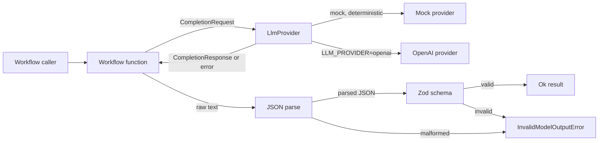
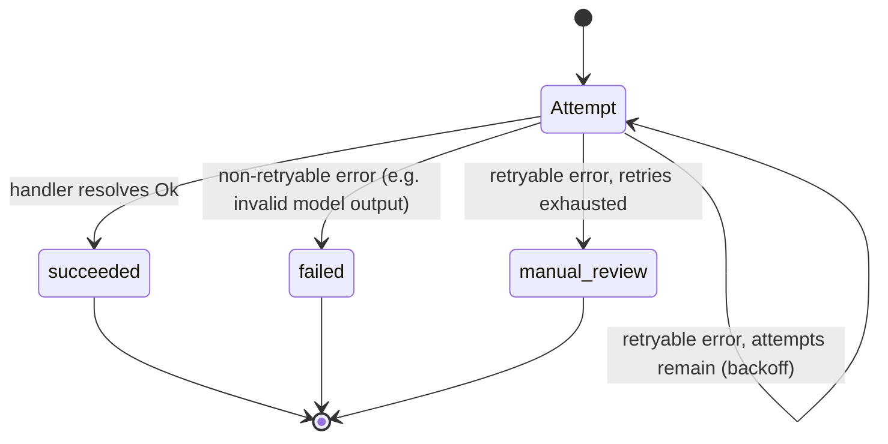

# WorkWise AI

[](https://github.com/webvoltz/workwise-ai-automation/actions/workflows/ci.yml)
[](LICENSE)

Small, production-style AI automation workflow examples: structured outputs, schema validation,
retries, mock providers, and explicit failure handling. Everything here is a pattern you can lift
into a real service, not a chatbot demo — every workflow runs fully offline against deterministic
mocks by default, so you can read, run, and test it without an API key.

## Why this exists

Most "AI automation" examples show a single happy-path prompt call. Production usage looks
different: the model's response has to be validated before anything trusts it, transient failures
need retries that don't loop forever, some failures aren't retryable at all, and a human eventually
needs to see the cases automation can't resolve. This repo is four small, focused workflows that
each demonstrate one of those shapes end to end, plus the shared plumbing (provider abstraction,
retry helper, error taxonomy) that makes them possible.

## Architecture



Every workflow follows the same shape: call the provider, parse the response as JSON, validate it
against a zod schema, and only then hand a typed value back to the caller. Nothing downstream of a
provider call ever trusts unvalidated model output. Success and failure are both ordinary return
values — a `Result<T, WorkflowError>` — rather than thrown exceptions, so a caller can compose
workflows (e.g. running one inside the async job runner) without wrapping every call in `try/catch`.

### Error taxonomy

| Error                     | Retryable | Meaning                                                              |
| ------------------------- | :-------: | -------------------------------------------------------------------- |
| `ProviderTimeoutError`    |    yes    | The provider call didn't complete before its timeout.                |
| `ProviderFailureError`    |    yes    | The provider call failed for another reason (network, non-2xx, etc). |
| `InvalidModelOutputError` |    no     | The response wasn't valid JSON, or failed schema validation.         |
| `RetryExhaustedError`     |    no     | Every attempt in a retry loop failed with a retryable error.         |

`InvalidModelOutputError` is deliberately non-retryable: providers are treated as deterministic for
a given input here (the mock always is), so replaying the exact same request would just fail
validation the same way again. A caller that wants a second opinion should build a new request
rather than lean on the generic retry loop.

## The four workflows

| Workflow                                                     | Pattern                             | Use it when...                                                                                                                                                    |
| ------------------------------------------------------------ | ----------------------------------- | ----------------------------------------------------------------------------------------------------------------------------------------------------------------- |
| [Support ticket classifier](src/workflows/ticket-classifier) | Structured output + validation      | You need the model to pick from a fixed set of labels (category, priority, ...) and you must be able to trust the shape of the answer.                            |
| [Document extraction](src/workflows/document-extraction)     | Structured output + partial success | You're pulling fields out of unstructured text and a _missing_ field is a normal outcome, not a crash — route it to review instead of failing the whole document. |
| [RAG knowledge lookup](src/workflows/rag-lookup)             | Retrieval + citation validation     | The answer must be grounded in known sources, and you don't trust the model to only cite sources it was actually given.                                           |
| [Async job runner](src/workflows/async-job)                  | Retry + terminal failure state      | The unit of work is a background job (not a synchronous request) and a transient failure should retry a bounded number of times before a human gets involved.     |

### Support ticket classifier

Classifies free-text tickets into `category`, `priority`, a `confidence` score, and a `rationale`.
The provider's raw text is parsed and validated before anything trusts it; malformed JSON or an
out-of-range value is rejected as `InvalidModelOutputError` rather than passed through.

### Document extraction

Extracts invoice fields (vendor, invoice number, total, due date) as validated, nullable JSON. A
document that's missing some fields isn't treated as a failure: the result reports exactly which
fields are missing and sets `status: "needs_review"`, so a partially readable document routes to a
human instead of being silently dropped or rejected outright.

### RAG knowledge lookup

A small in-memory knowledge base with naive keyword-overlap retrieval (no vector store needed for
the example) and a lookup workflow that asks the provider to answer strictly from the retrieved
sources. Citations are checked against the documents that were actually retrieved — any id the
model invents is dropped, and a response with zero genuine citations is rejected outright.

### Async job runner

Wraps a unit of work in retries and lands it in one of three terminal states instead of just
resolving or throwing:



Every attempt is recorded in an `attemptLog`, so a caller (or an on-call engineer) can see exactly
what happened before a job landed in `manual_review`.

## Project structure

```text
src/
  config/
    env.ts               Zod-validated environment configuration (fails fast, generic errors)
  providers/
    types.ts              LlmProvider interface shared by every provider
    mock-provider.ts       Deterministic offline provider driven by a scripted response queue
    openai-provider.ts     Optional real provider (fetch + timeout + response validation)
    provider-factory.ts    Picks mock vs. openai purely from LLM_PROVIDER
  shared/
    result.ts              Result<T, E> — ok()/err() instead of throwing across workflow boundaries
    errors.ts               WorkflowError taxonomy (see table above)
    retry.ts                withRetry(): backoff, non-retryable short-circuiting, RetryExhaustedError
    parse-json.ts           JSON.parse wrapped as a Result instead of a throw
  workflows/
    ticket-classifier/      Structured output + validation
    document-extraction/    Structured output + partial success (missing-field handling)
    rag-lookup/             Retrieval + citation validation
    async-job/               Retry + terminal failure/manual-review state
  index.ts                 Runs all four workflows against the mock provider
```

Every workflow directory follows the same layout: a zod `schema.ts` (or `types.ts`), the workflow
function itself, a `fixtures.ts` of deterministic inputs and scripted mock responses (reused by
both the tests and `src/index.ts`), and a co-located `*.test.ts`.

## Setup

Requires Node 24.x and npm 11.x (see `.nvmrc` / `package.json#engines`).

```sh
npm ci
npm run prepare      # installs the Husky git hooks
cp .env.example .env # optional — the defaults already run everything against the mock provider
```

Local commits are gated by [Gitleaks](https://github.com/gitleaks/gitleaks) 8.30.x. Install it and
make sure `gitleaks version` resolves before committing; CI runs an independent scan over full
history regardless.

## Running the examples

```sh
npm run dev     # runs src/index.ts with tsx, all four workflows against the mock provider
npm run build   # compiles to dist/
npm start       # runs the compiled dist/src/index.js
```

## Testing approach

```sh
npm test        # vitest run --coverage
npm run test:watch
```

- **Deterministic by construction.** Every test drives a workflow through `createMockProvider`
  with a scripted queue of responses (`{ type: 'text' | 'timeout' | 'failure' }`) — no network
  calls, no flakiness, no reliance on a real model's non-determinism.
- **Fixtures are shared, not duplicated.** Each workflow's `fixtures.ts` is imported by both its
  test file and `src/index.ts`, so the demo output and the test assertions can never drift apart.
- **Coverage is enforced, not aspirational.** `vitest.config.mts` sets V8 thresholds (90%
  statements/lines/functions, 85% branches) and `npm test` fails the run if they're not met. A
  couple of genuinely unreachable defensive branches (guaranteed by a zod schema's own runtime
  guarantees, or by an earlier `maxAttempts` guard) are marked with `/* v8 ignore */` and explained
  inline — that's a documented exception, not a workaround for missing tests.
- **Failure modes are tested explicitly**, not just the happy path: malformed JSON, schema
  validation failures, provider timeouts, hallucinated RAG citations, missing document fields,
  retry exhaustion, and the async job's escalation to `manual_review` all have their own test
  cases (see `src/workflows/failure-modes.test.ts` for the cross-workflow ones).

## Using a real LLM provider

Every workflow takes an `LlmProvider` as a plain argument — nothing in a workflow function knows or
cares whether it's talking to the mock or a real API. Switching is one environment variable:

```sh
LLM_PROVIDER=openai
OPENAI_API_KEY=sk-...
OPENAI_MODEL=gpt-4o-mini        # optional, this is the default
PROVIDER_TIMEOUT_MS=10000        # optional
```

`createProviderFromEnv()` reads these and returns the right provider. `OPENAI_API_KEY` is only
required when `LLM_PROVIDER=openai` — this is enforced at the environment-schema level (a
[discriminated union](src/config/env.ts), not just an `if` check) so a misconfigured deployment
fails at startup with a generic error rather than partway through a request. No test in this repo
calls a real provider or requires an API key; `openai-provider.test.ts` verifies the same logic
(timeout, non-2xx, malformed response) against a stubbed `fetch`.

Wiring in a different provider (Anthropic, a local model, etc.) means implementing `LlmProvider`
(one `complete()` method) — see [`src/providers/types.ts`](src/providers/types.ts).

## Production hardening notes

This is a demo repo, but the hardening choices in it aren't:

- **Never trust raw model output.** Every workflow parses-then-validates before returning a typed
  value. A model that returns prose instead of JSON, an out-of-enum value, or an out-of-range
  number is rejected, never coerced or silently accepted.
- **Retries are bounded and typed.** `withRetry` only retries errors marked `retryable`, applies
  linear backoff, and converts an exhausted retry loop into its own error type
  (`RetryExhaustedError`) rather than re-throwing the last transient error — so a caller can tell
  "the provider was flaky" apart from "we gave up."
- **`maxAttempts: 1` means exactly one attempt.** A subtle composition bug (see the `feat: add
async retry workflow` commit) came from a single-attempt retry wrapping its failure in a
  non-retryable error, which silently defeated an _outer_ retry loop wrapping it. Fixed and
  regression-tested — see `src/workflows/failure-modes.test.ts`.
- **Retryable and non-retryable failures are distinguished by type**, not by string-matching an
  error message — `WorkflowErrorCode` is a closed union and `switch` statements over it are
  compiler-checked for exhaustiveness (`@typescript-eslint/switch-exhaustiveness-check`).
- **Partial success is a first-class outcome.** Document extraction doesn't force a binary
  succeed/fail — a document missing some fields comes back as `needs_review` with the specific
  missing fields listed, so automation degrades to a human queue instead of silently dropping data.
- **Retrieval-augmented output is only as trustworthy as its citations.** The RAG workflow verifies
  every cited id against the documents it actually retrieved, drops anything hallucinated, and
  rejects a response with no genuine citations left.
- **Secrets never reach source control.** Gitleaks runs pre-commit locally (blocking) and again in
  CI over full history; `.env.example` ships only non-secret placeholder values.
- **Strict TypeScript, not just enabled TypeScript.** `noUncheckedIndexedAccess`,
  `exactOptionalPropertyTypes`, no unsafe `any`, `only-throw-error`, typed promise handling, and
  required exhaustiveness checks are all enforced — see [`tsconfig.json`](tsconfig.json) and
  [`eslint.config.mjs`](eslint.config.mjs).
- **CI is the same gate as local pre-commit, run independently.** Both run format/lint/typecheck,
  the full test suite with coverage thresholds, a secret scan, and the build — CI doesn't trust
  that a contributor's local hooks actually ran.

## Contributing

Commits follow [Conventional Commits](https://www.conventionalcommits.org/), enforced by
commitlint locally (`commit-msg` hook) and in CI. `develop` is the default/integration branch;
work happens on `feature/*` or `docs/*` branches and merges back into it.

## License

[MIT](LICENSE)
